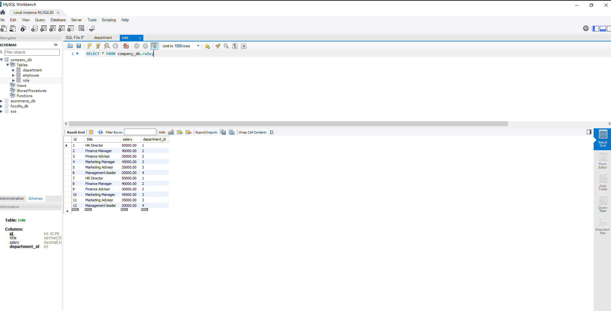
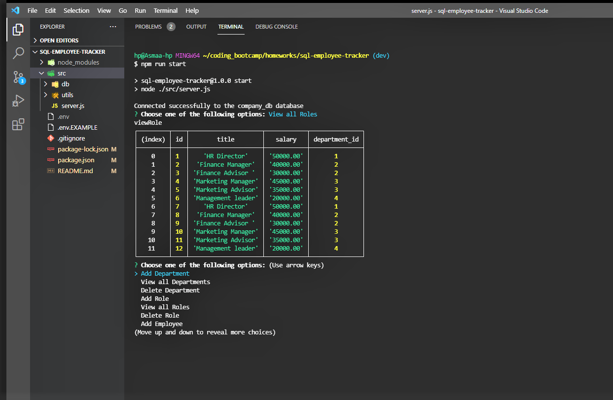

# Employee Tracker 

## Description:

For this project, my aim was to create a command-line application from scratch to manage a company's employee database using Node.js, Inquirer and MySql.

## Links:

Demo: https://drive.google.com/file/d/1BBoX-ylcKnCFjSRGYMI2oqUWK38DVb9T/view


Github: https://github.com/AsmaaMusse/sql-employee-tracker

## Technologies Used:

- Javascript
- Node.js
- Inquirer
- MySQL

## Usage:

### Installation

```
git@github.com:AsmaaMusse/sql-employee-tracker.git
cd sql-employee-tracker
npm install / npm i
```

### Start

```
npm run start
```

## Screenshots:





## Contribute

To contribute or ask questions, please <a href="https://mail.google.com/mail/u/0/?tf=cm&to=asmaamusse03@gmail.com&cc&bcc&su&body&fs=1">Email</a> here
